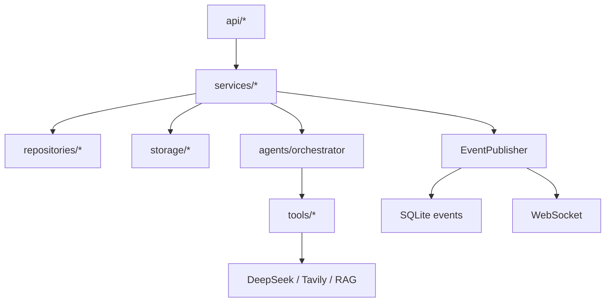

# UnifySeek

面向开发者的**深度调研系统**：输入一个技术调研问题，系统通过
DeepAgents 主从智能体编排自动检索网页、分析上传文档、读取本地知识库源码，把证据
归档到来源账本，最终产出**带可验证引用、标注冲突与未知项的 Markdown 报告**，并在
前端实时展示执行过程（单列阶段时间线 + 来源账本 + 交互式报告）。

灵感来自 [didilili/deepsearch-agents](https://github.com/didilili/deepsearch-agents)，
本仓库为洁净重构的独立实现：不复制其源码、Prompt、样式或测试数据。

## 核心能力

- **真实 Agent 闭环**：DeepAgents（基于 LangGraph）+ DeepSeek + Tavily，产出带 `[n]` 引用编号的报告
- **主从多智能体编排**：orchestrator（主编排）+ `web-researcher`（网页取证）+ `document-analyst`（文档/知识库分析）
- **本地知识库 + RAG**：docling 解析 + sentence-transformers embedding + Chroma 语义检索，读取 `knowledge_base/` 源码
- **证据校验与降级**：报告结构化校验（引用必须落在账本）、弱证据自动降级、失败转 `[DEGRADED]` 保闭环
- **事件流实时展示**：`astream_events(v2) → 业务事件 → WebSocket`，来源账本 S/D/K 三类标签
- **历史记录**：会话/run 按问题 slug 命名，支持点选恢复、删除

## 架构总览

后端依赖单向：`api → services → repositories/storage`；`services → agents → tools`；`domain` 为纯模型。



请求/事件流：

```
Vite(5173) --/api,/ws--> FastAPI --> services --> repositories/storage
AgentResearchExecutor: astream_events(v2) --> stream_adapter --> 业务事件
EventPublisher: 写库 --> 推 WS --> 前端按 seq 去重/补齐
```

### 关键技术选型

| 类别 | 选型 | 说明 |
|------|------|------|
| 后端 | Python 3.13 + FastAPI + uvicorn | REST + WebSocket |
| Agent 编排 | DeepAgents 0.6.x（LangGraph） | 主从多智能体 |
| LLM | DeepSeek（langchain-deepseek） | 推理与报告生成 |
| 搜索 | Tavily | 网页检索/正文提取 |
| 存储 | SQLite + aiosqlite | 元数据 |
| RAG | docling + sentence-transformers + Chroma + torch(cpu) | 纯 Python 无 Docker |
| 前端 | React 19 + TypeScript + Vite | 单列阶段驱动 UI |

### 设计决策叙事

- **主从编排而非单 Agent 直连**：网页取证、文档/知识库分析拆为专职子智能体，主智能体只做规划与委派，权限用 `FilesystemPermission` 全拒（禁止 ls/read_file/write_file 等）做工具/权限隔离。
- **事件协议统一 v2**：把 LangGraph `astream_events` 规约为业务事件，`seq` 递增、先落库再推送，断线按 `after_seq` 补齐，前端按 seq 去重。
- **证据校验分级**：结构错误（未知/缺失引用）→ `[DEGRADED]` 降级并附可归因 reason；弱证据 + high confidence 自动降为 medium 保持有效，避免模型自由发挥。
- **KB 相关性闸门 + 软预算**：先判断问题与知识库是否相关，无关则不检索；`search/read/list` 共享软预算防发散漫游，而 `record_knowledge_base_evidence`（落账本的唯一路径）豁免预算，保证相关证据必入账本（#44 教训：预算饿死会吞掉 K 证据）。
- **执行健壮性**：同步阻塞 offload 到线程池 + 阶段/空闲看门狗 + 硬超时收敛 + stale 回收；embedding 离线直载本地快照，杜绝联网挂起。
- **安全边界**：路径逃逸校验、绝对路径不暴露给前端、下载只走 `artifact_id`。

## 快速开始

### 一键启动（推荐）

双击 `start.bat`（同时拉起后端与前端）。

### 手动启动

```powershell
cd d:\code\Projects\DeepSearch_Agent\UnifySeek\backend
.venv\Scripts\python.exe -m ai_dev_researcher.main
```

健康检查：`GET http://127.0.0.1:<APP_PORT>/api/health`（`APP_PORT` 见 `backend/.env`，默认 8000）。

### 前端

```powershell
cd d:\code\Projects\DeepSearch_Agent\UnifySeek\frontend
npm install
npm run dev   # http://127.0.0.1:5173
```

### 配置（backend/.env）

```ini
DEEPSEEK_API_KEY=...   # 真实 Agent 必填
TAVILY_API_KEY=...     # 真实搜索必填
FAKE_AGENT_MODE=false  # false=真实 Agent；true=假执行器（无 key 演示）
WORKSPACE_ROOT=...     # 必须显式绝对路径（session/run 数据目录）
HF_HUB_CACHE=...       # embedding 模型本地缓存（离线加载）
```

## 依赖组

```powershell
cd backend
uv sync --extra dev                 # 基础 + 测试
uv sync --extra agent               # + DeepAgents/LangGraph/DeepSeek/Tavily（真实 Agent）
uv sync --extra rag                 # + docling/sentence-transformers/chromadb（RAG）
uv sync --extra agent --extra rag   # 全功能
```

> RAG 依赖含 torch（约 2GB）；embedding 模型（all-MiniLM-L6-v2，384 维）从
> `HF_HUB_CACHE` 指向的本地缓存离线加载，避免联网超时。

## 主线流程

1. 打开研究台，自动创建 session
2. 上传 PDF/DOCX/MD/TXT（可选）
3. 填写问题并启动研究（真实模式需 DeepSeek/Tavily key）
4. 观察单列阶段时间线（规划 / 调研取证 / 报告生成）
5. 查看来源账本（S=网页 / D=文档 / K=知识库，含 URL/路径/行号）与交互式报告（章节折叠、置信度 badge、Markdown 导出）

## 知识库与 RAG

- 本地知识库：`knowledge_base/`（项目根），document-analyst 可读取 `.md/.txt/.py/.json/.yaml/.toml` 并记录 K 类证据。
- 向量检索：上传文档经 docling 解析（失败回退 pypdf/python-docx）、分块 embedding 入 Chroma；知识库源码用 AST 结构感知分块（code_chunker）建独立 collection。
- 存量索引重建：`backend\scripts\rebuild_kb.py`（`--reset` 全量重建）。

## 测试

```powershell
cd d:\code\Projects\DeepSearch_Agent\UnifySeek\backend
.venv\Scripts\python.exe -m pytest tests/unit tests/e2e tests/integration -q   # 244 passed / 9 skipped

cd ..\frontend
npm test          # vitest，67 passed
npm run build     # tsc -b && vite build
```

覆盖：unit（agent_executor_v2_stream / stream_adapter / knowledge_base / report_schema / report_validation / kb_relevance_gates / security 等）、e2e（prompt_injection / permission_isolation）、integration（main_flow / rag_flow）。

## 目录结构

```
UnifySeek/
├── backend/          # Python 包 ai_dev_researcher
│   ├── src/ai_dev_researcher/   # api / services / agents / tools / storage / repositories / domain / core
│   ├── tests/                    # unit / e2e / integration
│   └── pyproject.toml / uv.lock
├── frontend/         # React 19 + Vite SPA
├── docs/             # 设计文档、验收报告、开发计划（gitignored）
├── knowledge_base/   # 本地调研素材（gitignored）
├── README.md
└── start.bat         # 一键启动
```
