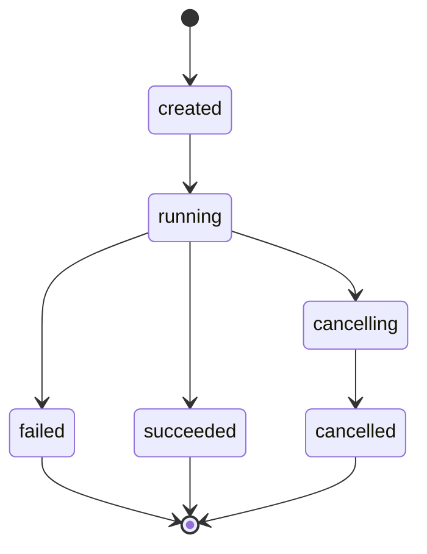
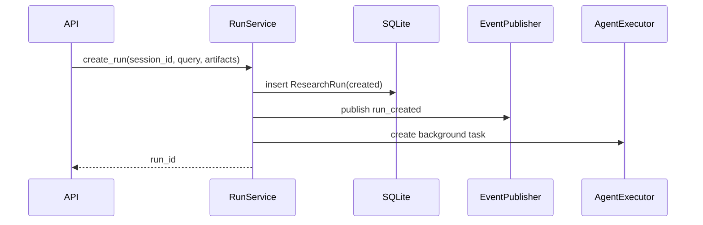
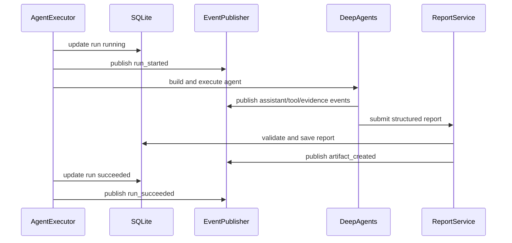
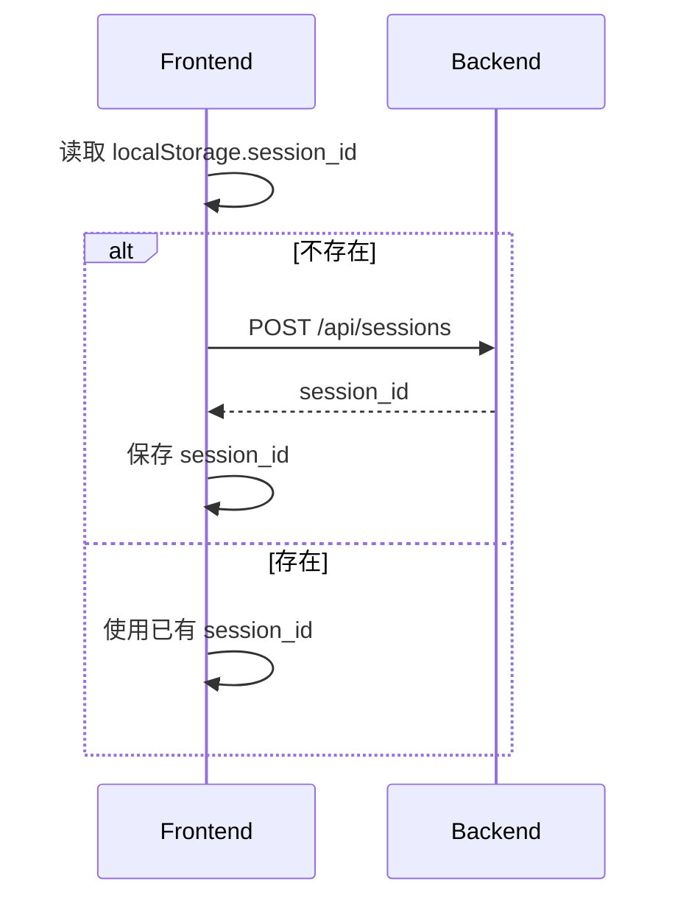
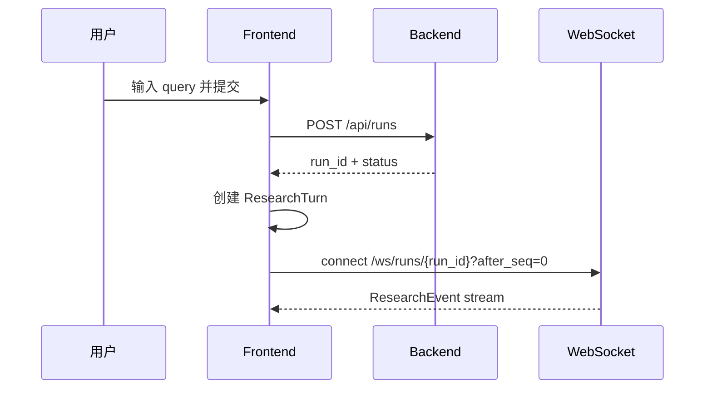
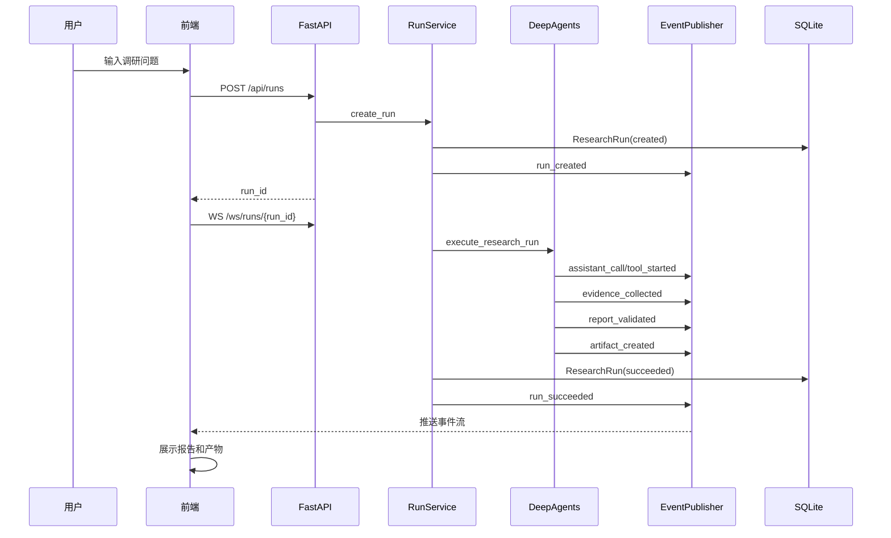
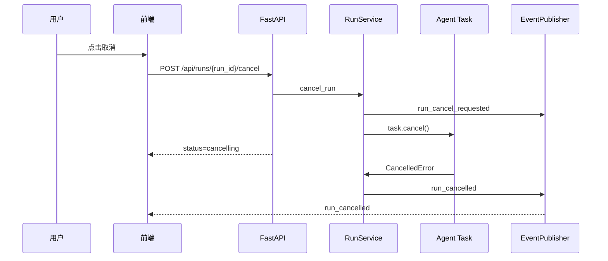
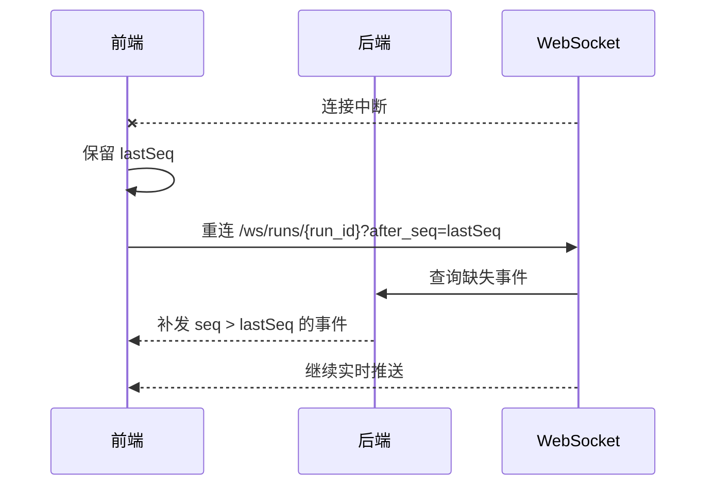

# DeepAgents 技术深度调研系统前后端逻辑设计文档

> 适用项目：`ai_dev_researcher`  
> 参考源码：`d:\code\Github_clone\deepsearch-agents`  
> 主计划文档：`项目二-DeepAgents技术深度调研开发计划.md`  
> 说明：本文档用于指导项目二从零实现前后端业务逻辑。参考项目只借鉴 REST + WebSocket + DeepAgents 编排思想，不直接照搬其全局 Agent、绝对路径暴露、单一 `thread_id`、非持久事件等实现。

---

## 1. 系统目标

本系统面向“AI 开发技术深度调研”场景，用户输入一个技术调研问题，可附加本地资料，系统通过 DeepAgents 主从智能体完成网络检索、文档分析、证据归档、报告生成，并在前端实时展示执行过程、最终 Markdown 报告和可下载产物。

MVP 目标：

- 支持创建调研会话。
- 支持上传资料并规范化为文本。
- 支持提交调研任务。
- 支持 WebSocket 实时展示 Agent 执行事件。
- 支持任务取消、失败、成功状态管理。
- 支持生成结构化调研报告并渲染为 Markdown。
- 支持按产物 ID 下载报告或证据账本。
- 支持断线后按事件序号补齐执行过程。

MVP 暂不包含：

- 用户登录与多用户权限。
- MySQL 子智能体。
- RAGFlow 子智能体。
- PDF 导出。
- 多任务并行执行。
- 云端部署。

---

## 2. 参考项目取舍

### 2.1 可借鉴设计

`deepsearch-agents` 中值得保留的架构思想：

- 前端通过 REST 启动任务，通过 WebSocket 接收执行事件。
- 每个任务拥有独立工作目录和产物目录。
- 工具调用时统一上报事件，前端以时间线形式展示。
- 上传文件先落盘，Agent 执行时读取。
- 前端采用聊天式单页交互，用户体验直观。
- 后端用 DeepAgents 实现“一主多从”的任务编排。

### 2.2 必须重写设计

参考项目中不适合直接复用的部分：

- 单一 `thread_id` 同时承担会话、任务、目录、WebSocket、LangGraph thread 等职责，需拆分。
- 前端只同步最后一轮 ChatTurn，导致多轮任务状态污染，需改为每个 run 独立状态。
- WebSocket 事件不持久化，断线后无法重放，需引入 `seq` 和事件存储。
- 后端返回服务器绝对路径，需改为只暴露 `artifact_id`。
- 全局 `main_agent` 和全局模型实例不利于测试与并发隔离，需改为 run 级工厂创建。
- Agent 异常只发 `error` 事件但任务仍可能被视为正常结束，需明确落库为 `failed`。
- 模型可直接写 Markdown 文件，需改为结构化报告提交 + 后端确定性渲染。
- 同一 `thread_id` 新任务自动取消旧任务，需改为返回 `409 active run`。

---

## 3. 核心业务对象

### 3.1 ResearchSession

用户侧调研会话，用于组织多个调研任务。

核心字段：

- `session_id`：服务端生成。
- `created_at`：创建时间。
- `updated_at`：更新时间。

业务规则：

- 前端首次进入页面时创建或恢复 session。
- session 本身不代表正在运行的任务。
- 一个 session 下可以有多个历史 run，但 MVP 同一时间只允许一个 active run。

### 3.2 ResearchRun

一次具体调研任务，是系统最核心的业务实体。

核心字段：

- `run_id`：服务端生成。
- `session_id`：所属会话。
- `query`：用户调研问题。
- `status`：任务状态。
- `created_at`：创建时间。
- `started_at`：开始时间。
- `finished_at`：结束时间。
- `cancel_requested_at`：取消请求时间。
- `error_message`：失败原因。

状态流转：



状态含义：

- `created`：任务已创建，后台执行尚未真正开始。
- `running`：Agent 正在执行。
- `cancelling`：用户已请求取消，后端正在中断任务。
- `cancelled`：任务已取消。
- `succeeded`：任务成功完成并生成报告。
- `failed`：任务执行失败。

### 3.3 ResearchEvent

任务执行过程事件，用于前端实时展示和断线重放。

核心字段：

- `event_id`：事件 ID。
- `run_id`：所属任务。
- `seq`：任务内递增序号。
- `type`：事件类型。
- `message`：面向用户展示的文案。
- `payload`：结构化附加数据。
- `created_at`：事件时间。

事件写入规则：

- 后端必须先持久化事件，再推送 WebSocket。
- WebSocket 推送失败不影响事件落库。
- 前端重连时通过 `after_seq` 补齐缺失事件。
- 前端按 `seq` 去重、排序、合并。

建议事件类型：

- `run_created`
- `run_started`
- `artifact_attached`
- `agent_started`
- `assistant_call`
- `tool_started`
- `tool_finished`
- `evidence_collected`
- `report_draft_started`
- `report_validated`
- `artifact_created`
- `run_succeeded`
- `run_failed`
- `run_cancel_requested`
- `run_cancelled`

### 3.4 Artifact

系统内所有文件产物的统一抽象，包括上传文件、规范化文本、报告、证据账本等。

核心字段：

- `artifact_id`：产物 ID。
- `session_id`：所属会话。
- `run_id`：可为空，上传阶段可能还未绑定 run。
- `kind`：产物类型。
- `display_name`：前端展示名称。
- `mime_type`：文件类型。
- `size`：文件大小。
- `storage_path`：服务端内部路径，不返回给前端。
- `created_at`：创建时间。

产物类型建议：

- `upload_original`
- `upload_normalized_text`
- `report_json`
- `report_markdown`
- `evidence_ledger`

业务规则：

- 前端只使用 `artifact_id` 下载或引用产物。
- 后端永远不向前端返回服务器绝对路径。
- 原始文件名只作为 metadata，不作为真实存储文件名。

### 3.5 EvidenceItem

调研证据条目。

核心字段：

- `evidence_id`：证据 ID。
- `run_id`：所属任务。
- `source_type`：来源类型，例如 `web`、`upload`。
- `title`：来源标题。
- `url`：网页来源地址，可为空。
- `snippet`：搜索摘要或局部摘录。
- `content_excerpt`：正文摘录。
- `retrieved_at`：采集时间。
- `quality`：质量等级或评分。

业务规则：

- Tavily search 结果默认只能作为低等级 `search_snippet`。
- 高质量结论应尽量来自网页正文提取或上传文档内容。
- 报告中的关键结论必须引用至少一个 `EvidenceItem`。

### 3.6 ResearchReport

最终报告结构化对象。

建议结构：

```json
{
  "title": "报告标题",
  "summary": "摘要",
  "sections": [
    {
      "heading": "章节标题",
      "content": "章节正文",
      "claims": ["claim_1"]
    }
  ],
  "claims": [
    {
      "claim_id": "claim_1",
      "text": "关键结论",
      "evidence_ids": ["ev_1", "ev_2"]
    }
  ],
  "limitations": ["局限性"],
  "next_steps": ["后续建议"]
}
```

业务规则：

- Agent 不直接写 Markdown 文件。
- Agent 通过 `submit_research_report` 提交结构化报告。
- 后端校验 claim 引用后，再确定性渲染 Markdown。
- 渲染后的 Markdown 作为 `report_markdown` artifact。

---

## 4. 后端逻辑设计

### 4.1 后端目录建议

```text
ai_dev_researcher/
└── backend/
    └── app/
        ├── api/
        │   ├── routes_sessions.py
        │   ├── routes_runs.py
        │   ├── routes_artifacts.py
        │   └── websocket.py
        ├── agent/
        │   ├── model_factory.py
        │   ├── main_agent.py
        │   ├── prompts.py
        │   └── subagents/
        │       ├── web_researcher.py
        │       └── document_analyst.py
        ├── services/
        │   ├── run_service.py
        │   ├── event_service.py
        │   ├── artifact_service.py
        │   ├── evidence_service.py
        │   └── report_service.py
        ├── tools/
        │   ├── web_search.py
        │   ├── read_artifact_text.py
        │   └── submit_research_report.py
        ├── storage/
        │   ├── paths.py
        │   └── file_store.py
        ├── db/
        │   ├── models.py
        │   └── repository.py
        ├── schemas/
        │   ├── run.py
        │   ├── event.py
        │   ├── artifact.py
        │   └── report.py
        ├── config.py
        └── main.py
```

### 4.2 API 层职责

API 层只负责协议、鉴权预留、参数校验和调用 service，不直接写复杂业务。

#### 创建会话

`POST /api/sessions`

响应：

```json
{
  "session_id": "sess_...",
  "created_at": "2026-07-13T14:00:00+08:00"
}
```

业务逻辑：

1. 服务端生成 `session_id`。
2. 写入 `ResearchSession`。
3. 返回 session 基本信息。

#### 上传文件

`POST /api/artifacts/upload`

请求：

- `session_id`
- `file`

响应：

```json
{
  "artifact_id": "art_...",
  "kind": "upload_original",
  "display_name": "用户上传文件.pdf",
  "parse_status": "parsed",
  "normalized_artifact_id": "art_..."
}
```

业务逻辑：

1. 校验 session 存在。
2. 生成 `artifact_id`。
3. 将原始文件保存到内部目录。
4. 根据文件类型解析为 normalized text。
5. 写入原始 artifact 和 normalized artifact。
6. 返回 artifact metadata。

#### 启动调研任务

`POST /api/runs`

请求：

```json
{
  "session_id": "sess_...",
  "query": "调研 DeepAgents 在 AI 开发工作流中的技术价值",
  "artifact_ids": ["art_..."]
}
```

响应：

```json
{
  "run_id": "run_...",
  "session_id": "sess_...",
  "status": "created"
}
```

业务逻辑：

1. 校验 `session_id`。
2. 校验 `query` 非空。
3. 校验 `artifact_ids` 均属于当前 session。
4. 检查当前 session 是否已有 active run。
5. 若已有 active run，返回 `409`。
6. 创建 `ResearchRun(status="created")`。
7. 写入 `run_created` 事件。
8. 创建后台任务执行 `execute_research_run(run_id)`。
9. 立即返回 `run_id`。

#### 取消任务

`POST /api/runs/{run_id}/cancel`

响应：

```json
{
  "run_id": "run_...",
  "status": "cancelling"
}
```

业务逻辑：

1. 查询 run。
2. 若 run 已经是 `succeeded`、`failed`、`cancelled`，直接返回当前状态。
3. 若 run 是 `running`，更新为 `cancelling`。
4. 写入 `run_cancel_requested` 事件。
5. 调用后台 task 的 `cancel()`。
6. 最终由执行层捕获取消并落 `cancelled`。

#### 查询任务

`GET /api/runs/{run_id}`

响应包含：

- run 基本状态。
- report artifact。
- artifacts 列表。
- 最新 `last_seq`。

#### 拉取事件

`GET /api/runs/{run_id}/events?after_seq=0`

响应：

```json
{
  "run_id": "run_...",
  "events": [],
  "last_seq": 12
}
```

业务逻辑：

1. 查询 `seq > after_seq` 的事件。
2. 按 seq 升序返回。
3. 用于页面恢复和 WebSocket 重连补偿。

#### WebSocket 连接

`WS /ws/runs/{run_id}?after_seq=0`

业务逻辑：

1. 校验 run 存在。
2. 连接建立后先补发 `after_seq` 之后的事件。
3. 注册当前 run 的 WebSocket 连接。
4. 后续新事件实时推送。
5. 支持心跳 ping/pong。
6. 断开后清理连接。

#### 查询产物元信息

`GET /api/artifacts/{artifact_id}`

业务逻辑：

1. 查询 artifact。
2. 校验 artifact 归属当前 session 或 run。
3. 返回 `artifact_id`、`kind`、`display_name`、`mime_type`、`size`、`created_at` 等元信息。
4. 不返回 `storage_path` 或任何服务器绝对路径。

#### 读取文本产物内容

`GET /api/artifacts/{artifact_id}/content`

业务逻辑：

1. 查询 artifact。
2. 仅允许读取 `report_markdown`、`upload_normalized_text`、`evidence_ledger` 等文本产物。
3. 校验文件路径位于允许的 storage root 内。
4. 返回文本内容，MVP 可一次性返回；后续大文件可增加 `offset` 和 `limit`。

#### 下载产物

`GET /api/artifacts/{artifact_id}/download`

业务逻辑：

1. 查询 artifact。
2. 校验文件路径位于允许的 storage root 内。
3. 使用 `FileResponse` 返回文件。
4. 不支持前端传路径下载。

### 4.3 RunService 执行逻辑

`RunService` 负责任务生命周期。

启动流程：



执行流程：



异常流程：

1. 捕获业务异常。
2. 更新 run 为 `failed`。
3. 写入 `run_failed` 事件。
4. 保存 `error_message`。

取消流程：

1. 捕获 `asyncio.CancelledError`。
2. 更新 run 为 `cancelled`。
3. 写入 `run_cancelled` 事件。
4. 重新抛出或正常结束均可，但数据库状态必须准确。

### 4.4 EventPublisher 逻辑

`EventPublisher` 替代参考项目的 `ToolMonitor`。

核心接口：

```python
async def publish(
    run_id: str,
    type: str,
    message: str,
    payload: dict | None = None,
) -> ResearchEvent:
    ...
```

执行顺序：

1. 查询当前 run 最大 `seq`。
2. 新事件 `seq = max_seq + 1`。
3. 写入 SQLite。
4. 尝试推送到 WebSocket。
5. 返回事件对象。

设计理由：

- 保证断线重连后可重放。
- 保证前端 UI 与后端事实一致。
- 避免 WebSocket 成为唯一事件来源。

### 4.5 AgentExecutor 逻辑

每个 run 单独构建 Agent。

不得使用：

- 模块级全局 `main_agent`。
- 模块级全局 checkpointer。
- 前端指定的 thread ID。
- Agent 任意写文件工具。

建议流程：

1. 加载 run、session、附件、配置。
2. 构造 `RunContext`。
3. 创建 DeepSeek ChatModel。
4. 创建 `web_researcher` 子智能体。
5. 创建 `document_analyst` 子智能体。
6. 创建主智能体。
7. 通过 `astream_events` 或兼容适配器解析执行事件。
8. 将 Agent 调度、工具开始、工具结束映射为 `ResearchEvent`。
9. 等待 `submit_research_report` 工具完成。
10. 更新 run 终态。

### 4.6 子智能体职责

#### web_researcher

职责：

- 针对用户问题拆分网络检索角度。
- 调用 Tavily 获取候选来源。
- 对关键来源提取正文或摘要。
- 创建 `EvidenceItem`。
- 不负责最终报告写作。

约束：

- 最多执行有限次数搜索，避免无限扩展。
- 返回证据摘要和证据 ID。
- 不直接输出最终结论。

#### document_analyst

职责：

- 阅读用户上传资料的 normalized text。
- 提取与问题相关的事实、定义、限制、案例。
- 创建 `EvidenceItem(source_type="upload")`。
- 返回证据 ID 和摘要。

约束：

- 只能通过 `artifact_id` 读取文本。
- 必须使用 offset/limit 分段读取。
- 不允许传文件路径。

### 4.7 工具设计

#### web_search

输入：

```json
{
  "query": "搜索问题",
  "max_results": 5
}
```

输出：

```json
{
  "items": [
    {
      "evidence_id": "ev_...",
      "title": "来源标题",
      "url": "https://...",
      "snippet": "摘要"
    }
  ]
}
```

业务逻辑：

1. 写入 `tool_started`。
2. 调用 Tavily。
3. 将搜索结果转为 EvidenceItem。
4. 写入 `evidence_collected`。
5. 写入 `tool_finished`。

#### read_artifact_text

输入：

```json
{
  "artifact_id": "art_...",
  "offset": 0,
  "limit": 4000
}
```

业务逻辑：

1. 校验 artifact 属于当前 session 或 run。
2. 校验 artifact 类型是 normalized text。
3. 读取指定范围文本。
4. 返回文本片段和总长度。

#### submit_research_report

输入为结构化报告 JSON。

业务逻辑：

1. 写入 `report_draft_started`。
2. 校验报告结构。
3. 校验每条 claim 至少有一个 evidence 引用。
4. 校验 evidence 属于当前 run。
5. 保存 `report_json`。
6. 确定性渲染 Markdown。
7. 创建 `report_markdown` artifact。
8. 写入 `report_validated` 和 `artifact_created`。

### 4.8 存储与路径安全

建议内部目录：

```text
data/
├── app.db
├── uploads/
│   └── {artifact_id}/
│       ├── original
│       └── normalized.txt
├── runs/
│   └── {run_id}/
│       └── report.json
└── artifacts/
    └── {artifact_id}/
        └── content.md
```

路径安全规则：

- 所有路径由后端根据 ID 计算。
- 前端不得传入本地路径或服务器路径。
- 下载前必须校验路径在允许根目录内。
- 拒绝 `..`、符号链接逃逸和任意绝对路径。
- 上传文件真实保存名使用 UUID，不使用原始文件名。

---

## 5. 前端逻辑设计

### 5.1 前端目录建议

```text
ai_dev_researcher/
└── frontend/
    └── src/
        ├── App.tsx
        ├── components/
        │   ├── ResearchComposer.tsx
        │   ├── RunThread.tsx
        │   ├── EventTimeline.tsx
        │   ├── ArtifactShelf.tsx
        │   └── MarkdownReport.tsx
        ├── hooks/
        │   ├── useResearchSession.ts
        │   └── useResearchRun.ts
        ├── lib/
        │   ├── api.ts
        │   ├── ws.ts
        │   └── config.ts
        ├── types.ts
        └── main.tsx
```

### 5.2 页面结构

页面采用单页聊天式布局：

```text
App
├── Sidebar
│   ├── 项目标题
│   ├── Session 信息
│   ├── 当前连接状态
│   └── 新建会话按钮
└── Main
    ├── RunThread
    │   └── ResearchTurn[]
    │       ├── 用户问题
    │       ├── EventTimeline
    │       ├── MarkdownReport
    │       └── ArtifactShelf
    └── ResearchComposer
        ├── 附件列表
        ├── 输入框
        ├── 上传按钮
        ├── 提交按钮
        └── 取消按钮
```

### 5.3 前端状态模型

不要使用参考项目的全局 `events/files/result` 同步到最后一轮的模式。

建议状态：

```typescript
type ResearchTurn = {
  runId: string;
  query: string;
  status: RunStatus;
  events: ResearchEvent[];
  lastSeq: number;
  artifacts: Artifact[];
  reportMarkdown?: string;
  errorMessage?: string;
  createdAt: string;
};
```

`App` 顶层状态：

- `sessionId`
- `turns`
- `composerQuery`
- `composerAttachments`
- `activeRunId`

业务规则：

- 每个 run 独立保存事件、状态、报告和产物。
- 新任务不会覆盖旧任务的结果。
- 旧任务卡片在任务结束后保持静态。
- active run 存在时禁用再次提交，或在后端返回 409 后提示用户。

### 5.4 页面加载逻辑



### 5.5 上传附件逻辑

用户选择文件后：

1. 前端调用 `POST /api/artifacts/upload`。
2. 上传中显示 pending 状态。
3. 上传成功后加入 composer attachments。
4. 上传失败时只影响该文件，不影响已上传文件。
5. 提交任务时把 attachment 的 `artifact_id` 带给后端。

与参考项目前端的区别：

- 参考项目选择文件后立即上传，这点可保留。
- 但新项目必须保存 `artifact_id`，不保存服务器路径。
- 上传成功后应展示解析状态，例如 `parsed`、`parse_failed`。

### 5.6 提交任务逻辑

流程：



前端处理：

1. 校验输入非空。
2. 调用 `createRun`。
3. 成功后创建新的 `ResearchTurn`。
4. 清空输入框。
5. 建立 WebSocket。
6. 按事件更新对应 turn。

后端返回 `409` 时：

- 不创建新的 turn。
- 提示“当前会话已有任务运行中，请先取消或等待完成”。

### 5.7 WebSocket 与事件重放逻辑

`useResearchRun(runId)` 职责：

- 建立 `WS /ws/runs/{runId}?after_seq={lastSeq}`。
- 收到事件后根据 `seq` 去重。
- 按事件类型更新 turn 状态。
- 断线后 2 秒重连。
- 重连时继续携带最新 `lastSeq`。
- 心跳超时后主动重连。

事件到 UI 映射：

| 事件类型 | UI 行为 |
|---|---|
| `run_created` | 显示任务已创建 |
| `run_started` | turn 状态变为 running |
| `assistant_call` | 时间线展示子智能体调用 |
| `tool_started` | 时间线展示工具开始 |
| `tool_finished` | 时间线展示工具完成 |
| `evidence_collected` | 时间线展示证据采集 |
| `artifact_created` | ArtifactShelf 增加产物 |
| `run_succeeded` | turn 状态变为 succeeded，展示报告 |
| `run_failed` | turn 状态变为 failed，展示错误 |
| `run_cancelled` | turn 状态变为 cancelled |

### 5.8 取消任务逻辑

前端流程：

1. 用户点击取消按钮。
2. 调用 `POST /api/runs/{run_id}/cancel`。
3. 本地将状态显示为 `cancelling`。
4. 等待 WebSocket 收到 `run_cancelled`。
5. 若 WebSocket 断开，重连后通过事件重放获取最终状态。

幂等处理：

- 如果取消请求返回 run 已结束，前端直接同步为后端状态。
- 如果请求失败但 WebSocket 随后收到 `run_cancelled`，以事件为准。

### 5.9 报告展示逻辑

报告展示来源：

- 优先从 `run_succeeded` 或 `artifact_created` 事件 payload 获取 report artifact。
- 如事件中只有 artifact ID，前端调用 `GET /api/artifacts/{artifact_id}` 获取 metadata。
- Markdown 内容可以通过专门接口读取，或通过 artifact 下载后渲染，MVP 建议增加读取接口。

展示组件：

- `MarkdownReport`：渲染 Markdown。
- `ArtifactShelf`：展示报告、证据账本、上传文件。
- `EventTimeline`：保留完整执行轨迹。

### 5.10 错误展示逻辑

错误分类：

- 输入错误：展示在输入框附近。
- 上传错误：展示在附件条目上。
- API 错误：展示 toast 或 alert。
- run 执行错误：展示在对应 run 卡片内。
- WebSocket 错误：展示“连接中断，正在重连，历史事件会自动补齐”。

不要使用单一全局 `lastError` 覆盖所有任务。

---

## 6. 前后端协议

### 6.1 创建会话

`POST /api/sessions`

响应：

```json
{
  "session_id": "sess_abc123",
  "created_at": "2026-07-13T14:00:00+08:00"
}
```

### 6.2 上传文件

`POST /api/artifacts/upload`

响应：

```json
{
  "artifact_id": "art_original_123",
  "normalized_artifact_id": "art_text_456",
  "kind": "upload_original",
  "display_name": "deepagents-notes.pdf",
  "mime_type": "application/pdf",
  "size": 102400,
  "parse_status": "parsed"
}
```

### 6.3 创建任务

`POST /api/runs`

请求：

```json
{
  "session_id": "sess_abc123",
  "query": "调研 DeepAgents 在 AI 开发工作流中的技术价值",
  "artifact_ids": ["art_text_456"]
}
```

响应：

```json
{
  "run_id": "run_abc123",
  "session_id": "sess_abc123",
  "status": "created"
}
```

### 6.4 事件对象

```json
{
  "event_id": "evt_001",
  "run_id": "run_abc123",
  "seq": 12,
  "type": "evidence_collected",
  "message": "已采集网络证据：DeepAgents 官方文档",
  "payload": {
    "evidence_id": "ev_001",
    "title": "DeepAgents Documentation",
    "source_type": "web"
  },
  "created_at": "2026-07-13T14:01:00+08:00"
}
```

### 6.5 查询事件

`GET /api/runs/{run_id}/events?after_seq=12`

响应：

```json
{
  "run_id": "run_abc123",
  "events": [],
  "last_seq": 12
}
```

### 6.6 Artifact 对象

```json
{
  "artifact_id": "art_report_001",
  "run_id": "run_abc123",
  "kind": "report_markdown",
  "display_name": "deepagents-tech-research.md",
  "mime_type": "text/markdown",
  "size": 18432,
  "created_at": "2026-07-13T14:05:00+08:00"
}
```

### 6.7 读取文本产物内容

`GET /api/artifacts/{artifact_id}/content`

响应：

```json
{
  "artifact_id": "art_report_001",
  "kind": "report_markdown",
  "content": "# DeepAgents 技术调研报告\n\n..."
}
```

### 6.8 下载产物

`GET /api/artifacts/{artifact_id}/download`

响应：

- 成功：文件流。
- 失败：`404` 或 `403`，不泄露服务器内部路径。

---

## 7. 端到端业务流程

### 7.1 正常完成流程



### 7.2 取消流程



### 7.3 断线重连流程



---

## 8. 实施优先级

### 阶段 1：后端无 Agent 纵向切片

目标：先打通 API、事件、WebSocket、Artifact。

实现内容：

- SQLite 数据模型。
- `POST /api/sessions`。
- `POST /api/artifacts/upload`。
- `POST /api/runs`。
- fake run 后台任务。
- fake events 推送。
- fake Markdown report artifact。
- `GET /api/runs/{run_id}/events`。
- `WS /ws/runs/{run_id}`。
- `GET /api/artifacts/{artifact_id}/download`。

验收：

- 前端或 curl 能创建任务。
- WebSocket 能看到事件。
- 断线后能按 `after_seq` 补齐。
- 能下载 fake report。

### 阶段 2：前端接入真实协议

目标：完成用户可见闭环。

实现内容：

- `useResearchSession`。
- `useResearchRun`。
- `ResearchComposer`。
- `RunThread`。
- `EventTimeline`。
- `ArtifactShelf`。
- `MarkdownReport`。

验收：

- 页面可上传文件、提交任务、看到事件、看到报告、下载产物。
- 多个历史 run 独立展示，互不污染。

### 阶段 3：接入 DeepSeek + DeepAgents

目标：让 fake run 替换为真实 Agent。

实现内容：

- `build_model`。
- `build_main_agent`。
- `web_researcher`。
- `web_search` 工具。
- Agent 事件适配。

验收：

- 输入真实调研问题后能采集网络证据。
- 前端时间线能看到 Agent 和工具事件。
- 失败时 run 正确进入 `failed`。

### 阶段 4：证据与报告校验

目标：保证报告不是模型自由发挥。

实现内容：

- `EvidenceStore`。
- `submit_research_report`。
- claim 引用校验。
- Markdown 确定性渲染。

验收：

- 报告关键结论均带 evidence 引用。
- 缺少 evidence 的报告提交会失败。
- 成功后生成 `report_json` 和 `report_markdown`。

### 阶段 5：文档分析与安全加固

目标：支持上传资料参与调研，并补齐 MVP 安全边界。

实现内容：

- 文件解析为 normalized text。
- `document_analyst`。
- `read_artifact_text`。
- 路径安全校验。
- 取消幂等。
- 心跳超时重连。
- 错误展示优化。

验收：

- 上传文档能被 Agent 引用为证据。
- 前端不接触绝对路径。
- 任意路径下载被拒绝。
- 取消和重连稳定。

---

## 9. 验收标准

最终 MVP 应满足：

- 用户可以创建会话、上传文件、提交调研任务。
- 前端能实时展示 Agent 执行过程。
- 每个 run 的事件、状态、报告、产物互相独立。
- WebSocket 断线重连后能补齐事件。
- 后端不向前端暴露服务器绝对路径。
- 同一 session 有 active run 时，新任务返回 `409`。
- 任务异常会进入 `failed`，并展示错误。
- 用户取消任务后最终进入 `cancelled`。
- 最终报告由结构化 JSON 确定性渲染 Markdown。
- 报告关键结论至少引用一个 EvidenceItem。
- 产物下载只能通过 `artifact_id`。

---

## 10. 后续开发建议

建议先不要直接写完整 Agent，而是按“无 Agent 纵向切片 → 前端接入 → 真实 Agent → 证据校验 → 文件分析”的顺序推进。这样可以先验证前后端协议、事件重放、产物下载和状态机，再接入 DeepAgents，避免把 UI、协议、Agent 调试和文件安全全部耦合在一起。
